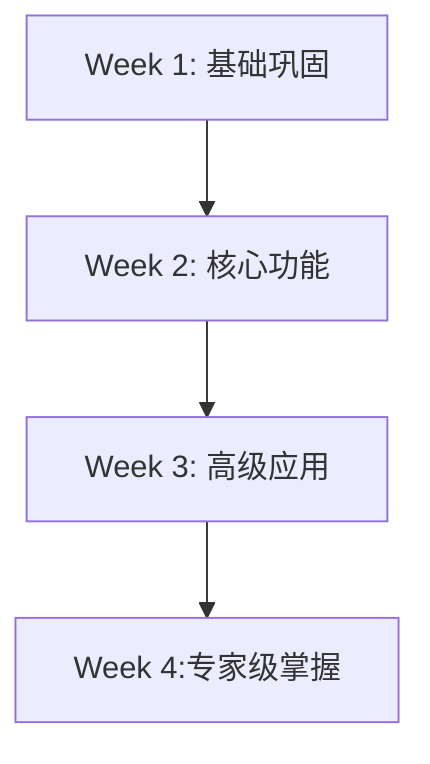

# 🎯 Cypress 全面复习计划

## 📋 计划概览

**目标**: 系统复习和深化 Cypress 测试技能，从基础到专家级应用
**总时长**: 4周（建议每天2-3小时）
**学习方式**: 理论复习 + 代码实践 + 项目应用

---

## 🗓️ 四阶段学习路线图



---

## 📅 第一周：基础巩固 (Days 1-7)

### 🎯 学习目标
- 回顾 Cypress 基础概念
- 强化核心命令使用
- 建立良好的测试习惯

### 📚 复习内容

#### Day 1: 环境和基础回顾
**文件**: `day1-setup-test.cy.js`, `day2-first-test.cy.js`
**时间**: 2小时

**复习重点**:
- ✅ Cypress 安装和配置
- ✅ 测试文件结构 (`describe`, `it`)
- ✅ 基本导航 (`cy.visit()`)
- ✅ 元素选择 (`cy.get()`, `cy.contains()`)

**实践任务**:
```javascript
// 练习 1: 重新编写第一个测试
describe('基础复习', () => {
  it('应该访问页面并验证标题', () => {
    cy.visit('https://example.cypress.io')
    cy.get('h1').should('contain', 'Kitchen Sink')
    cy.title().should('include', 'Cypress')
  })
})
```

#### Day 2: 选择器和交互深化
**文件**: `day3-basic-commands.cy.js`, `day4-selectors-and-actions.cy.js`
**时间**: 3小时

**复习重点**:
- 🎯 选择器优先级策略
- 🎯 各种交互命令 (`.click()`, `.type()`, `.select()`)
- 🎯 断言系统 (`.should()`)
- 🎯 表单操作

**选择器优先级复习**:
1. ⭐⭐⭐⭐⭐ `[data-cy="..."]` - 测试专用属性
2. ⭐⭐⭐⭐ `#id` - ID 选择器
3. ⭐⭐⭐ `.class` - Class 选择器
4. ⭐⭐ `tag` - 标签选择器

**实践任务**:
- 重写所有基础测试，使用最佳选择器
- 创建复杂表单交互测试

#### Day 3-4: 异步处理和组织
**文件**: `day5-async-handling.cy.js`, `day6-test-organization.cy.js`
**时间**: 4小时

**复习重点**:
- ⏳ 异步等待策略
- 🔄 Hooks 使用 (`before`, `beforeEach`)
- 📋 测试组织最佳实践

**实践任务**:
- 重构现有测试，使用 Hooks 优化
- 处理动态加载内容

#### Day 5-7: 网络和数据
**文件**: `day7-network-intercept.cy.js`, `day8-async-operations.cy.js`
**时间**: 6小时

**复习重点**:
- 🌐 `cy.intercept()` 网络拦截
- 📡 API 测试和模拟
- 🔗 请求响应验证

**实践任务**:
```javascript
// 网络拦截练习
cy.intercept('GET', '/api/users', { fixture: 'users.json' }).as('getUsers')
cy.visit('/users')
cy.wait('@getUsers')
cy.get('@getUsers').should('have.property', 'response')
```

---

## 📅 第二周：核心功能深化 (Days 8-14)

### 🎯 学习目标
- 掌握文件操作和自定义命令
- 精通数据驱动测试
- 学会性能监控

### 📚 复习内容

#### Day 8-9: 文件操作
**文件**: `day9-file-operations.cy.js`
**时间**: 4小时

**复习重点**:
- 📁 文件读写操作
- 📤 文件上传测试
- 📥 文件下载验证

**实践任务**:
```javascript
// 文件操作综合练习
describe('文件操作测试', () => {
  it('应该上传并验证文件', () => {
    cy.fixture('sample.pdf', 'base64').then(fileContent => {
      cy.get('input[type="file"]').selectFile({
        contents: Cypress.Buffer.from(fileContent, 'base64'),
        fileName: 'test.pdf',
        mimeType: 'application/pdf'
      })
    })
  })
})
```

#### Day 10-11: 自定义命令和插件
**文件**: `day10-custom-commands.cy.js`
**时间**: 5小时

**复习重点**:
- 🛠️ 创建可复用的自定义命令
- 🔧 参数化命令设计
- 🎨 Page Object 模式

**实践任务**:
```javascript
// 在 cypress/support/commands.js 中创建
Cypress.Commands.add('loginAs', (role) => {
  const users = {
    admin: { username: 'admin', password: 'admin123' },
    user: { username: 'user', password: 'user123' }
  }

  const user = users[role]
  cy.session([role], () => {
    cy.visit('/login')
    cy.get('[data-cy="username"]').type(user.username)
    cy.get('[data-cy="password"]').type(user.password)
    cy.get('[data-cy="submit"]').click()
    cy.url().should('not.contain', '/login')
  })
})
```

#### Day 12-13: 数据驱动测试
**文件**: `day11-data-driven.cy.js`
**时间**: 4小时

**复习重点**:
- 📋 Fixtures 数据管理
- 🔄 参数化测试
- 🎲 测试数据生成

**实践任务**:
```javascript
// 数据驱动测试示例
const testScenarios = require('../../fixtures/search-scenarios.json')

testScenarios.forEach((scenario) => {
  it(`搜索测试: ${scenario.name}`, () => {
    cy.visit('/search')
    cy.get('[data-cy="search-input"]').type(scenario.query)
    cy.get('[data-cy="search-submit"]').click()
    cy.get('[data-cy="results"]').should('contain', scenario.expectedResult)
  })
})
```

#### Day 14: 性能监控
**文件**: `day12-performance-monitoring.cy.js`
**时间**: 3小时

**复习重点**:
- 📊 性能指标收集
- ⚡ 页面加载时间监控
- 🎯 Core Web Vitals

---

## 📅 第三周：高级应用 (Days 15-21)

### 🎯 学习目标
- 学习企业级测试架构
- 掌握 CI/CD 集成
- 优化测试性能

### 📚 复习内容

#### Day 15-16: 高级架构模式
**文件**: `day15-advanced-patterns.cy.js`
**时间**: 6小时

**复习重点**:
- 🏗️ Page Object Model 设计
- 🔧 App Actions 模式
- 📦 测试工具函数

**实践任务**:
```javascript
// Page Object 模式示例
class LoginPage {
  visit() {
    cy.visit('/login')
  }

  fillUsername(username) {
    cy.get('[data-cy="username"]').type(username)
    return this
  }

  fillPassword(password) {
    cy.get('[data-cy="password"]').type(password)
    return this
  }

  submit() {
    cy.get('[data-cy="submit"]').click()
    return this
  }

  login(username, password) {
    return this.fillUsername(username)
               .fillPassword(password)
               .submit()
  }
}
```

#### Day 17-18: CI/CD 集成
**文件**: `day16-cicd-integration.cy.js`
**时间**: 5小时

**复习重点**:
- 🚀 GitHub Actions 配置
- 📊 测试报告生成
- 🔔 失败通知机制

**实践任务**:
```yaml
# .github/workflows/cypress.yml
name: Cypress Tests
on: [push, pull_request]
jobs:
  cypress-run:
    runs-on: ubuntu-latest
    steps:
      - name: Checkout
        uses: actions/checkout@v4

      - name: Cypress run
        uses: cypress-io/github-action@v6
        with:
          start: npm start
          wait-on: 'http://localhost:3000'
```

#### Day 19-21: 性能优化
**文件**: `day17-performance-optimization.cy.js`
**时间**: 7小时

**复习重点**:
- ⚡ 测试执行速度优化
- 🔀 并行测试执行
- 📦 资源复用策略

---

## 📅 第四周：专家级掌握 (Days 22-28)

### 🎯 学习目标
- 掌握企业级框架设计
- 精通跨浏览器测试
- 实现可访问性测试

### 📚 复习内容

#### Day 22-23: 企业框架设计
**文件**: `day18-enterprise-framework.cy.js`
**时间**: 6小时

**复习重点**:
- 🏢 企业框架架构
- 📚 测试套件组织
- 🔧 配置管理系统

#### Day 24-25: 跨浏览器测试
**文件**: `day19-cross-browser.cy.js`
**时间**: 5小时

**复习重点**:
- 🌐 跨浏览器测试策略
- 📱 响应式设计测试
- 🔧 浏览器特定处理

**实践任务**:
```javascript
// 跨浏览器测试配置
const browsers = ['chrome', 'firefox', 'edge']

browsers.forEach(browser => {
  describe(`在 ${browser} 中的测试`, () => {
    before(() => {
      cy.log(`当前浏览器: ${browser}`)
    })

    it('应该在所有浏览器中正常工作', () => {
      cy.visit('/')
      cy.get('h1').should('be.visible')
    })
  })
})
```

#### Day 26-27: 可访问性和质量保证
**文件**: `day20-accessibility-qa.cy.js`
**时间**: 5小时

**复习重点**:
- ♿ 自动化可访问性测试
- 🎯 WCAG 标准验证
- ⌨️ 键盘导航测试

**实践任务**:
```javascript
// 可访问性测试示例
describe('可访问性测试', () => {
  it('应该支持键盘导航', () => {
    cy.visit('/')

    // 测试Tab键导航
    cy.get('body').tab()
    cy.focused().should('have.attr', 'href')

    // 测试键盘操作
    cy.focused().type('{enter}')
    cy.url().should('not.equal', Cypress.config().baseUrl)
  })

  it('应该有适当的ARIA标签', () => {
    cy.visit('/')
    cy.get('[role="button"]').should('exist')
    cy.get('img').should('have.attr', 'alt')
  })
})
```

#### Day 28: 综合项目实战
**文件**: `day5-ecommerce-project.cy.js`
**时间**: 4小时

**复习重点**:
- 🛒 真实项目应用
- 🔄 端到端测试流程
- 📊 综合质量验证

---

## 🛠️ 实践项目建议

### 项目一：个人博客测试套件
- 创建完整的博客测试覆盖
- 实现用户注册、登录、发布文章流程
- 添加评论系统测试

### 项目二：电商网站测试框架
- 设计 Page Object 架构
- 实现购物车、支付流程测试
- 添加跨浏览器兼容性测试

### 项目三：企业级 Dashboard 测试
- 创建数据驱动的报表测试
- 实现权限和角色测试
- 添加性能监控和可访问性测试

---

## 📊 学习进度追踪

### 每日自检清单
- [ ] 完成理论复习 (30-45分钟)
- [ ] 完成代码实践 (60-90分钟)
- [ ] 完成实践项目 (30-45分钟)
- [ ] 记录学习笔记和问题
- [ ] 复习前一天的内容 (15分钟)

### 每周评估标准
**第一周结束**:
- [ ] 能独立编写基础 E2E 测试
- [ ] 掌握核心命令和选择器
- [ ] 理解异步处理机制

**第二周结束**:
- [ ] 能创建自定义命令
- [ ] 掌握文件操作和数据驱动
- [ ] 理解网络拦截和 API 测试

**第三周结束**:
- [ ] 能设计测试架构
- [ ] 掌握 CI/CD 集成
- [ ] 理解性能优化策略

**第四周结束**:
- [ ] 能设计企业级框架
- [ ] 掌握跨浏览器测试
- [ ] 能进行可访问性测试

---

## 💡 学习技巧和建议

### 🎯 高效学习方法
1. **边学边练**: 每学一个概念立即动手实践
2. **重复强化**: 每天花15分钟复习前一天内容
3. **项目驱动**: 将学习内容应用到实际项目中
4. **问题导向**: 遇到问题时深入研究直到完全理解

### 📝 记录和总结
1. **学习笔记**: 记录重要概念和代码片段
2. **问题日志**: 记录遇到的问题和解决方案
3. **最佳实践**: 总结自己的最佳实践模板
4. **项目文档**: 为每个练习项目写文档

### 🔍 调试技巧回顾
1. **Time Travel**: 利用 Cypress 的时间旅行功能
2. **Console Logs**: 使用 `cy.log()` 添加调试信息
3. **断点调试**: 使用 `.debug()` 暂停执行
4. **截图记录**: 失败时自动截图分析

### 📚 参考资源
- [Cypress 官方文档](https://docs.cypress.io/)
- [Cypress 最佳实践](https://docs.cypress.io/guides/references/best-practices)
- [Cypress 示例项目](https://github.com/cypress-io/cypress-example-kitchensink)
- [Cypress Discord 社区](https://discord.gg/cypress)

---

## 🎯 复习计划执行建议

### 时间安排建议
- **工作日**: 每天1.5-2小时（晚上7-9点）
- **周末**: 每天3-4小时（分上下午两段）
- **总时间**: 约80-100小时

### 学习环境设置
1. 准备专门的学习环境
2. 关闭不必要的干扰
3. 使用番茄工作法（25分钟专注+5分钟休息）
4. 准备笔记本记录问题和心得

### 难点预期和解决方案
**常见难点**:
- 异步处理理解
- 网络拦截配置
- Page Object 设计
- CI/CD 配置

**解决策略**:
- 多练习类似场景
- 查阅官方文档和社区讨论
- 寻求社区帮助
- 与其他开发者交流

---

## 🎉 完成后的技能水平

完成本复习计划后，你将达到以下技能水平：

### 🏆 专家级能力
- 独立设计和实施企业级测试框架
- 指导团队测试最佳实践
- 优化现有测试流程和架构
- 解决复杂的测试场景问题

### 🚀 实际应用能力
- 为任何 Web 应用创建完整测试覆盖
- 集成测试到 CI/CD 流水线
- 实施跨浏览器和可访问性测试
- 建立测试质量监控体系

### 💼 职业发展价值
- 测试自动化工程师
- QA 架构师
- DevOps 工程师
- 全栈开发工程师（测试专精）

---

**祝你学习顺利！成为 Cypress 测试专家！** 🎯💪

*记住：坚持实践是掌握 Cypress 的关键。每天的小进步积累起来就是巨大的成就！*